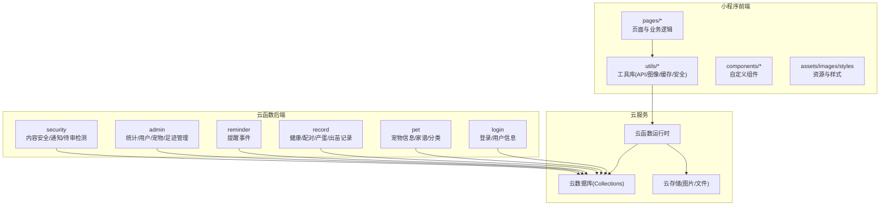
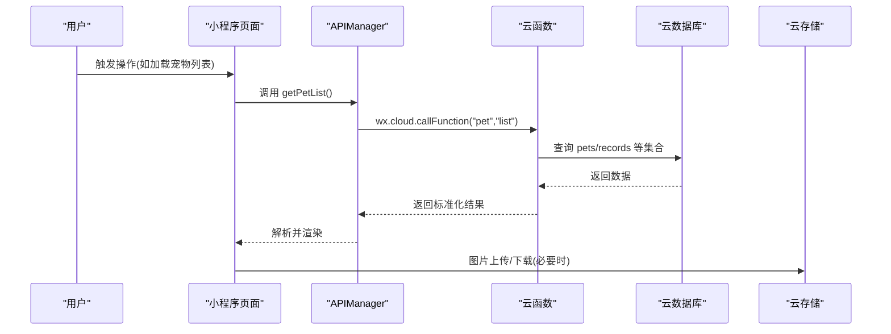
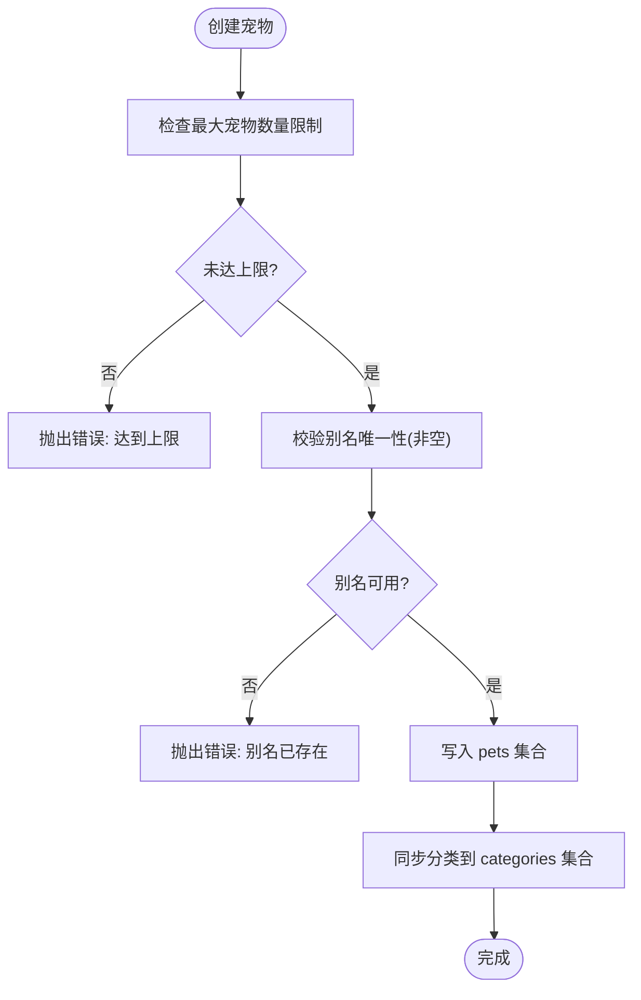
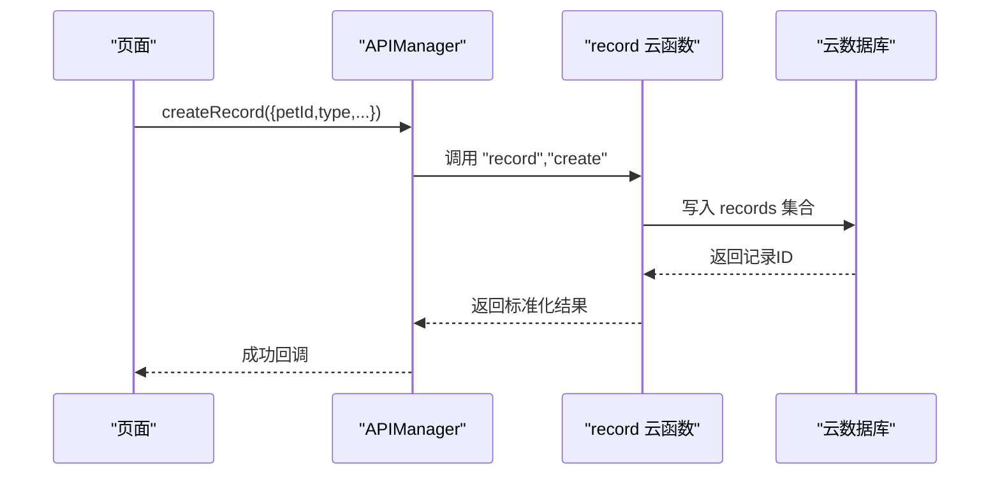
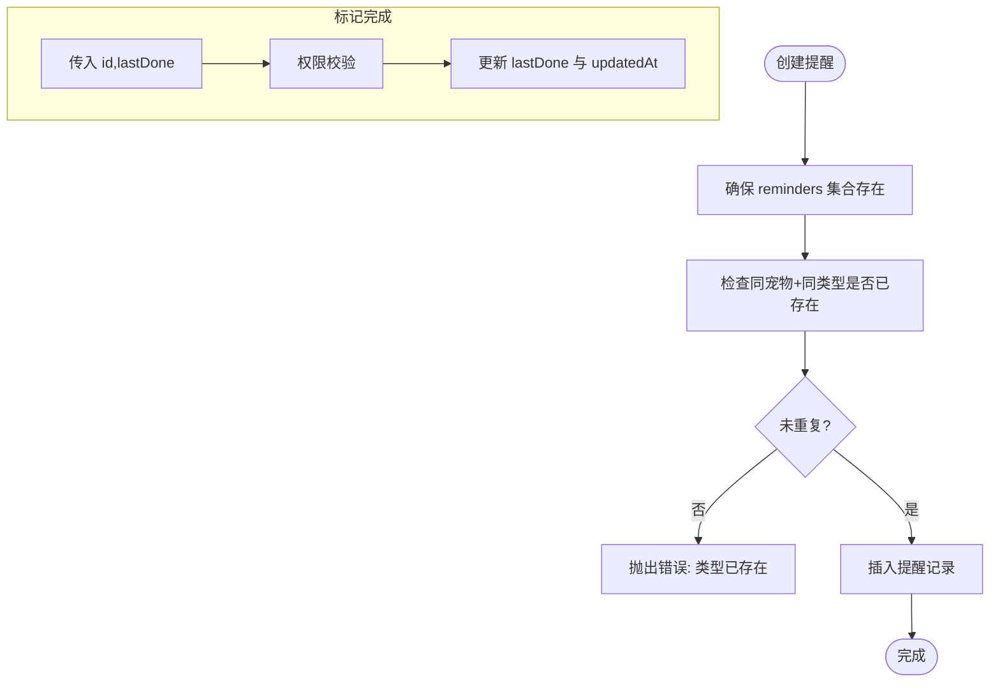
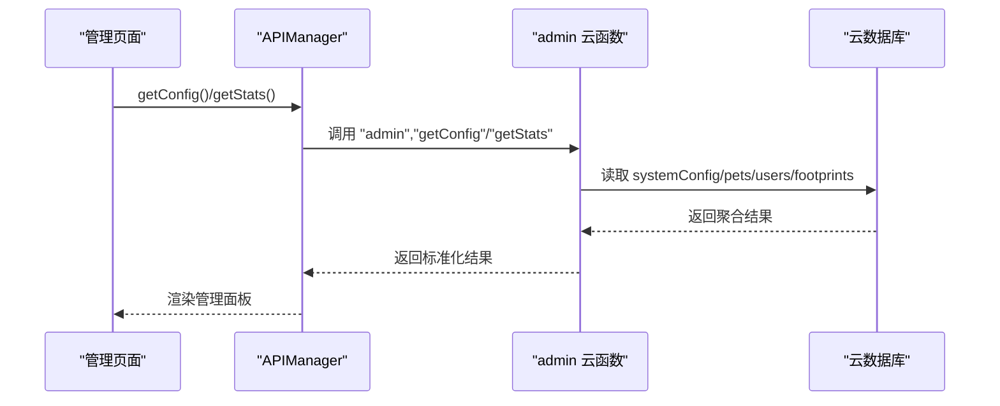
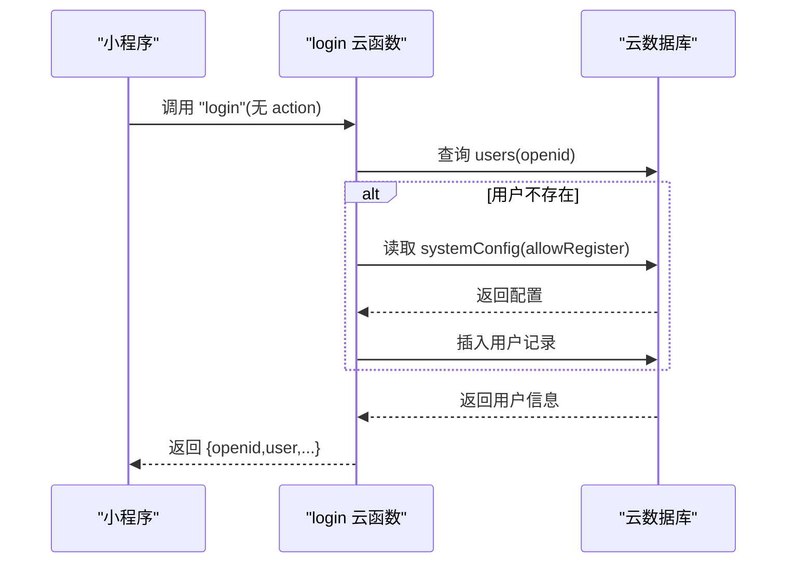
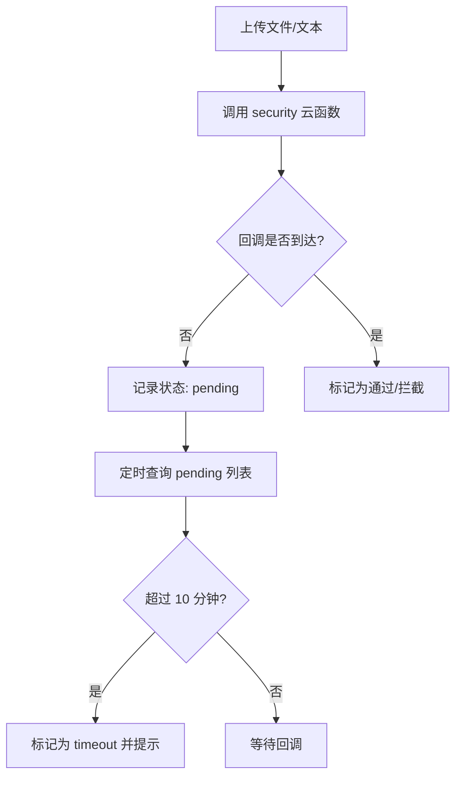
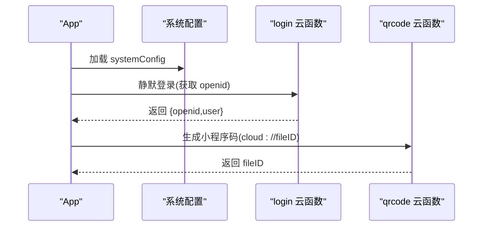
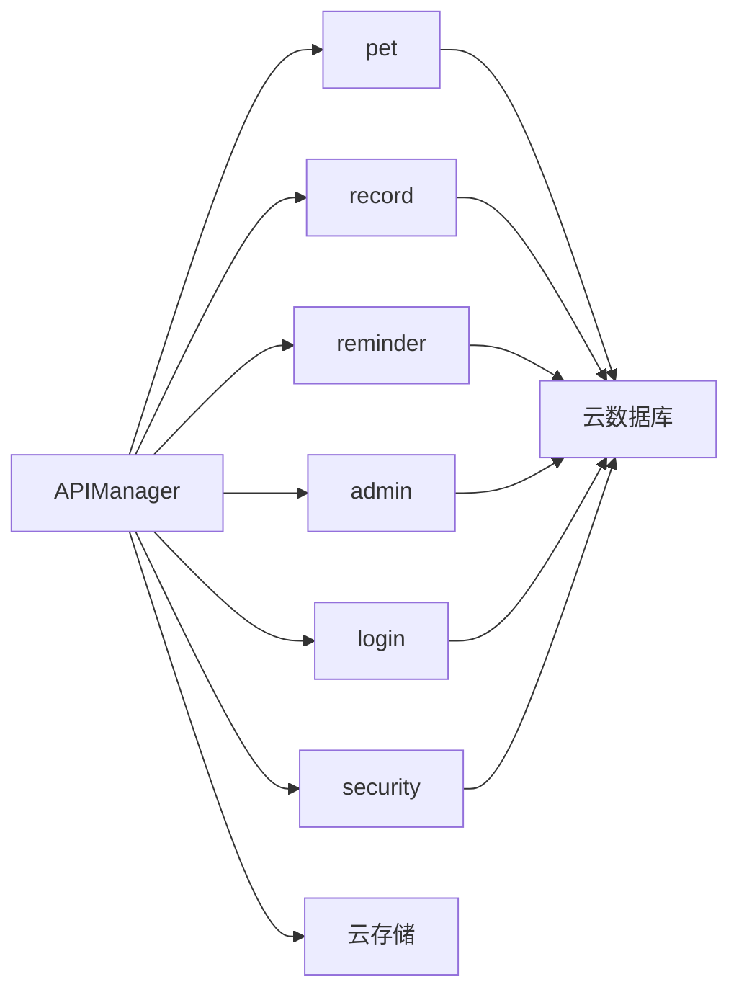

# 项目概述

<cite>
**本文引用的文件**
- [miniprogram/app.js](file://miniprogram/app.js)
- [miniprogram/app.json](file://miniprogram/app.json)
- [miniprogram/utils/api.js](file://miniprogram/utils/api.js)
- [miniprogram/pages/pet/index.js](file://miniprogram/pages/pet/index.js)
- [miniprogram/pages/my/index.js](file://miniprogram/pages/my/index.js)
- [cloudfunctions/common/utils.js](file://cloudfunctions/common/utils.js)
- [cloudfunctions/login/index.js](file://cloudfunctions/login/index.js)
- [cloudfunctions/admin/index.js](file://cloudfunctions/admin/index.js)
- [cloudfunctions/pet/index.js](file://cloudfunctions/pet/index.js)
- [cloudfunctions/record/index.js](file://cloudfunctions/record/index.js)
- [cloudfunctions/reminder/index.js](file://cloudfunctions/reminder/index.js)
- [cloudfunctions/security/index.js](file://cloudfunctions/security/index.js)
- [miniprogram/project.config.json](file://miniprogram/project.config.json)
</cite>

## 目录
1. [引言](#引言)
2. [项目结构](#项目结构)
3. [核心组件](#核心组件)
4. [架构总览](#架构总览)
5. [详细组件分析](#详细组件分析)
6. [依赖分析](#依赖分析)
7. [性能考虑](#性能考虑)
8. [故障排查指南](#故障排查指南)
9. [结论](#结论)
10. [附录](#附录)

## 引言
“养龟档案”是一个基于微信小程序的龟类宠物档案管理系统，旨在帮助用户高效管理宠物信息、追踪健康记录、管理繁殖计划、查询家谱、设置提醒以及生成分享卡片等。项目采用“前端小程序 + 微信云开发”的架构，通过云函数提供业务能力，结合云数据库与云存储实现数据持久化与资源管理。

- 项目目标
  - 提供完整的宠物档案生命周期管理
  - 支持健康、繁殖、配对、产蛋、出苗等多维度记录
  - 提供家谱查询、提醒系统、公开档案分享与打印能力
  - 保障内容安全与合规，提供审核通知与超时检测

- 应用场景
  - 龟类爱好者与繁育者日常管理
  - 繁殖计划制定与追踪
  - 宠物健康与事件记录
  - 公开档案展示与社交分享

- 目标用户
  - 个人宠物主、龟类繁育者、爱好者社群成员

## 项目结构
项目采用“小程序前端 + 云函数后端”的分层组织方式，主要目录与职责如下：
- miniprogram：小程序前端代码，包含页面、组件、工具库与样式
- cloudfunctions：云函数集合，按业务域拆分（pet、record、reminder、admin、security 等）
- design-preview：静态页面预览（用于设计稿验证）
- html2image-server：图片生成服务（与分享卡片生成相关）
- cloudflare-worker：边缘计算脚本（与部署或网关相关）

图表来源
- [miniprogram/app.json:1-74](file://miniprogram/app.json#L1-L74)
- [cloudfunctions/common/utils.js:1-69](file://cloudfunctions/common/utils.js#L1-L69)

章节来源
- [miniprogram/app.json:1-74](file://miniprogram/app.json#L1-L74)
- [miniprogram/project.config.json:1-34](file://miniprogram/project.config.json#L1-L34)

## 核心组件
- 应用入口与全局状态
  - 小程序启动时初始化云开发，加载系统配置，自动登录并生成小程序码，提供登录态校验与通知检查
- API 管理器
  - 统一封装云函数调用，提供宠物、记录、提醒、足迹、登录、图片上传等接口
- 页面与功能模块
  - 宠物列表与详情：支持筛选、搜索、状态计算、扫码跳转、家谱查询
  - 我的页面：统计、分享卡片、打印配置、系统配置、回收站与最近浏览
  - 云函数：登录、宠物、记录、提醒、管理员后台、安全审核

章节来源
- [miniprogram/app.js:1-312](file://miniprogram/app.js#L1-L312)
- [miniprogram/utils/api.js:1-208](file://miniprogram/utils/api.js#L1-L208)
- [miniprogram/pages/pet/index.js:1-800](file://miniprogram/pages/pet/index.js#L1-L800)
- [miniprogram/pages/my/index.js:1-800](file://miniprogram/pages/my/index.js#L1-L800)

## 架构总览
系统采用“前端小程序 + 微信云开发”的轻量后端架构，核心交互链路如下：

图表来源
- [miniprogram/utils/api.js:12-38](file://miniprogram/utils/api.js#L12-L38)
- [cloudfunctions/pet/index.js:45-82](file://cloudfunctions/pet/index.js#L45-L82)
- [cloudfunctions/common/utils.js:20-35](file://cloudfunctions/common/utils.js#L20-L35)

## 详细组件分析

### 宠物管理模块（pet）
- 主要能力
  - 宠物增删改查、分类管理、别名唯一性校验、公开/私密切换
  - 家谱树构建（父系/母系主线）、谱系统计
  - 公开宠物列表与详情（无需权限）
- 关键流程
  - 创建宠物时检查系统配置中的最大宠物数量限制
  - 更新宠物时同步分类至 categories 集合
  - 家谱查询支持最大代数配置，默认 3 代

图表来源
- [cloudfunctions/pet/index.js:84-138](file://cloudfunctions/pet/index.js#L84-L138)

章节来源
- [cloudfunctions/pet/index.js:1-723](file://cloudfunctions/pet/index.js#L1-L723)

### 记录管理模块（record）
- 主要能力
  - 健康、配对、产蛋、出苗等事件记录的增删改查
  - 产蛋/出苗记录附加数量统计字段
  - 记录关联宠物与用户，支持按宠物与类型筛选
- 关键流程
  - 创建记录时根据类型附加对应字段
  - 权限校验：仅记录创建者可更新/删除

图表来源
- [cloudfunctions/record/index.js:37-82](file://cloudfunctions/record/index.js#L37-L82)
- [miniprogram/utils/api.js:86-96](file://miniprogram/utils/api.js#L86-L96)

章节来源
- [cloudfunctions/record/index.js:1-191](file://cloudfunctions/record/index.js#L1-L191)
- [miniprogram/utils/api.js:86-96](file://miniprogram/utils/api.js#L86-L96)

### 提醒事件模块（reminder）
- 主要能力
  - 按宠物+类型去重的提醒配置
  - 按间隔天数自动提醒，支持标记完成
  - 支持查询某宠物提醒与全量提醒
- 关键流程
  - 创建提醒前检查同类型重复
  - 标记完成时更新 lastDone 与 updatedAt

图表来源
- [cloudfunctions/reminder/index.js:55-102](file://cloudfunctions/reminder/index.js#L55-L102)
- [cloudfunctions/reminder/index.js:191-204](file://cloudfunctions/reminder/index.js#L191-L204)

章节来源
- [cloudfunctions/reminder/index.js:1-205](file://cloudfunctions/reminder/index.js#L1-L205)

### 管理后台模块（admin）
- 主要能力
  - 统计数据聚合（用户/宠物/足迹总量、今日活跃、增长率）
  - 用户/宠物/足迹列表查询与筛选
  - 系统配置读取与更新
  - 用户封禁/解封联动
- 关键流程
  - 管理员鉴权：优先从数据库读取，兜底内置管理员列表
  - 统计并发查询多个集合，使用 Promise.all

图表来源
- [cloudfunctions/admin/index.js:27-71](file://cloudfunctions/admin/index.js#L27-L71)
- [cloudfunctions/admin/index.js:434-473](file://cloudfunctions/admin/index.js#L434-L473)

章节来源
- [cloudfunctions/admin/index.js:1-533](file://cloudfunctions/admin/index.js#L1-L533)

### 登录与用户模块（login）
- 主要能力
  - 静默获取 openid，创建/更新用户记录
  - 管理员鉴权与用户信息更新
  - 公开名片信息维护（用于公开档案页展示）
- 关键流程
  - 首次登录检查系统配置是否允许注册
  - 用户信息更新时仅更新传入字段

图表来源
- [cloudfunctions/login/index.js:38-147](file://cloudfunctions/login/index.js#L38-L147)

章节来源
- [cloudfunctions/login/index.js:1-148](file://cloudfunctions/login/index.js#L1-L148)

### 内容安全与通知模块（security）
- 主要能力
  - 图片/文本内容安全审核薄包装
  - 审核通知查询与标记已读
  - 未回调审核记录的超时检测（超过 10 分钟标记为 timeout）
- 关键流程
  - 异步审核回调未到达时，记录状态为 pending
  - 超时检测定时刷新 pending 列表

图表来源
- [cloudfunctions/security/index.js:15-64](file://cloudfunctions/security/index.js#L15-L64)
- [cloudfunctions/security/index.js:151-200](file://cloudfunctions/security/index.js#L151-L200)

章节来源
- [cloudfunctions/security/index.js:1-200](file://cloudfunctions/security/index.js#L1-L200)

### 前端应用与页面（app.js、pages）
- 应用生命周期
  - 初始化云开发与系统配置
  - 自动登录与小程序码生成
  - 登录态校验与通知检查
- 页面功能
  - 宠物页：骨架屏优化、分页加载、状态计算、扫码跳转、家谱查询
  - 我的页：统计聚合、分享卡片生成、打印配置、系统配置、回收站与最近浏览

图表来源
- [miniprogram/app.js:1-174](file://miniprogram/app.js#L1-L174)

章节来源
- [miniprogram/app.js:1-312](file://miniprogram/app.js#L1-L312)
- [miniprogram/pages/pet/index.js:1-800](file://miniprogram/pages/pet/index.js#L1-L800)
- [miniprogram/pages/my/index.js:1-800](file://miniprogram/pages/my/index.js#L1-L800)

## 依赖分析
- 前端依赖
  - APIManager 统一调用云函数，封装错误处理与降级策略
  - 图像工具负责云存储 URL 转换与安全审核触发
  - 缓存与分类同步确保离线可用与一致性
- 云函数依赖
  - 统一工具库提供数据库初始化、OPENID 获取、响应封装
  - 各模块云函数独立部署，通过 action 字段路由到具体方法
- 数据依赖
  - 宠物、记录、提醒、足迹、用户、系统配置等集合
  - 云存储用于图片与文件持久化

图表来源
- [miniprogram/utils/api.js:12-38](file://miniprogram/utils/api.js#L12-L38)
- [cloudfunctions/common/utils.js:1-69](file://cloudfunctions/common/utils.js#L1-L69)

章节来源
- [miniprogram/utils/api.js:1-208](file://miniprogram/utils/api.js#L1-L208)
- [cloudfunctions/common/utils.js:1-69](file://cloudfunctions/common/utils.js#L1-L69)

## 性能考虑
- 骨架屏与最小展示时长
  - 宠物页在首次加载时强制展示骨架屏至少 600ms，避免闪烁
- 分页与去重
  - 宠物列表分页加载，合并云端与本地缓存，避免重复渲染
- 并发与序列号
  - 请求序列号防过期，避免并发请求覆盖新数据
- 本地缓存与降级
  - 云函数失败时回退到本地缓存数据，提升可用性
- 图片 URL 净化
  - 将过期临时 URL 转换为永久 cloud://fileID，减少无效请求

章节来源
- [miniprogram/pages/pet/index.js:147-154](file://miniprogram/pages/pet/index.js#L147-L154)
- [miniprogram/pages/pet/index.js:209-250](file://miniprogram/pages/pet/index.js#L209-L250)
- [cloudfunctions/pet/index.js:16-43](file://cloudfunctions/pet/index.js#L16-L43)

## 故障排查指南
- 登录失败
  - 检查云函数返回的 warning 或错误消息，确认数据库集合是否存在
  - 确认系统配置中的注册开关
- 云函数调用失败
  - 查看 APIManager 的错误返回与 useFallback 标志
  - 检查网络状态与云函数可用性
- 图片上传与审核
  - 上传成功后异步触发安全审核，若长时间无回调，检查 security 云函数的 pending 列表
- 提醒与通知
  - 确认提醒类型是否重复，检查 lastDone 更新是否成功
  - 审核通知未读状态可通过安全云函数查询并标记已读

章节来源
- [cloudfunctions/login/index.js:136-147](file://cloudfunctions/login/index.js#L136-L147)
- [miniprogram/utils/api.js:27-38](file://miniprogram/utils/api.js#L27-L38)
- [cloudfunctions/security/index.js:151-200](file://cloudfunctions/security/index.js#L151-L200)
- [cloudfunctions/reminder/index.js:191-204](file://cloudfunctions/reminder/index.js#L191-L204)

## 结论
“养龟档案”项目通过清晰的前后端分层与模块化云函数设计，实现了从宠物信息管理到健康记录、繁殖追踪、家谱查询与提醒通知的完整闭环。项目在用户体验方面注重骨架屏、分页与缓存策略，在数据安全方面引入内容审核与通知机制，并通过公开档案与分享卡片增强社交传播。整体架构简洁可靠，适合持续扩展与迭代。

## 附录
- 技术栈概览
  - 小程序前端：WXML/WXSS/JS + 微信云开发
  - 云函数：Node.js（按模块拆分）
  - 数据存储：云数据库集合（pets、records、reminders、users、systemConfig 等）
  - 文件存储：云存储（图片/文件）
- 设计与部署
  - 项目配置与打包规则见小程序工程配置文件
  - 云函数按模块独立部署，统一通过 APIManager 调用

章节来源
- [miniprogram/project.config.json:1-34](file://miniprogram/project.config.json#L1-L34)